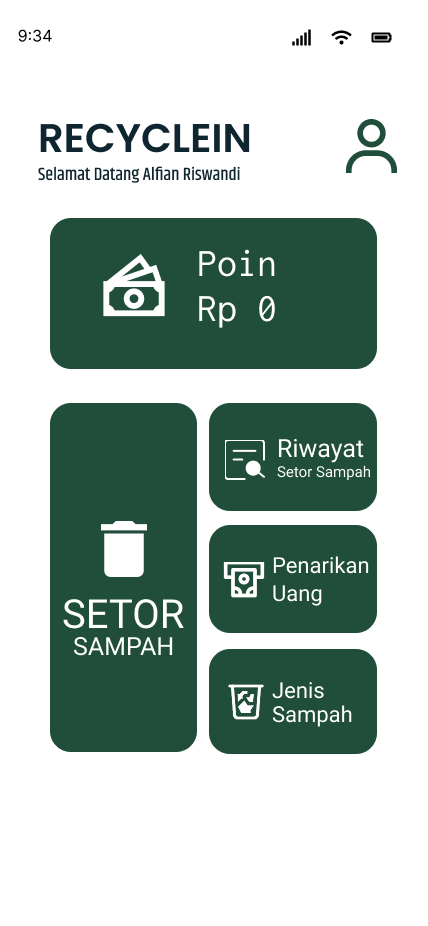
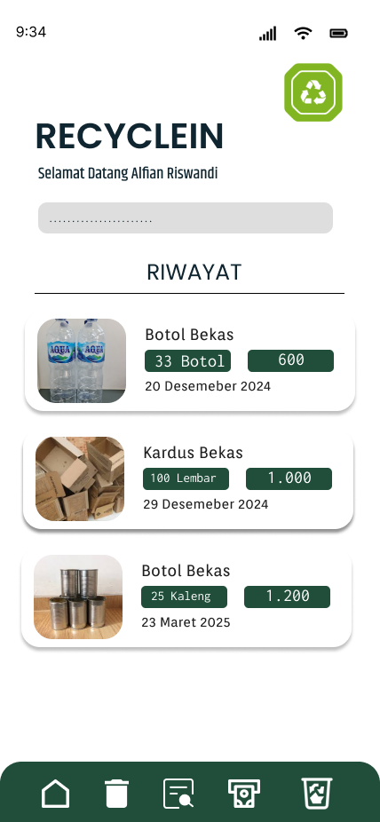

# ♻️ Recyclein – Aplikasi Pengelolaan Sampah Berbasis Komunitas
----------
Recyclein adalah aplikasi mobile yang bertujuan untuk membantu masyarakat dalam memilah, menyetorkan, dan mendaur ulang sampah secara lebih mudah, menyenangkan, dan berdampak positif bagi lingkungan.

  

## Fitur Utama
---
- Setor Sampah ke mitra terdekat
- Riwayat penyetoran sampah
- Tukar Poin dengan reward menarik
- Edukasi jenis sampah yang bisa didaur ulang
- Daftar mitra (toko / bank sampah)
 

## Teknologi yang Digunakan
---
- Kotlin (Mobile Development)
- Firebase (Backend dan Auth)
- Figma (UI/UX Design)
- gitHub
 

## 👥 Tim Pengembang
---

| Nama     | Peran    | Tanggung Jawab                                  |
|----------|----------|--------------------------------------------------|
| Amanda   | Hipster  | Desain UI/UX, brand, dan tampilan aplikasi       |
| Budi     | Hacker   | Pengembangan fitur aplikasi dan database         |
| Citra    | Hustler  | Riset pasar, validasi pengguna, dan kemitraan    |
 

## Preview Aplikasi
---

  
  
  

 

## Demo / Prototype
---
Klik Disini : [Figma♻️Recyclein](https://www.figma.com/design/5BaWlsKGdJLzqud52EnTX1/tecnoh?node-id=34-109&t=Dy9LvGwwZLzLvovo-0)
 

## Pitch Deck
---
Lihat file pitch deck kami di sini:  
➡️ [Download PDF Pitch Deck](Assets/picth%20deck.pdf)
 

## Video Demo Aplikasi
---
Lihat Video Demo Kami di Youtube:  
▶️[🔴Youtube](https://youtu.be/S7qUUE0MH8Q)
 

*"Terima kasih telah peduli terhadap lingkungan bersama Recyclein 🌱"*

## License
---
This project is licensed under the MIT License.
